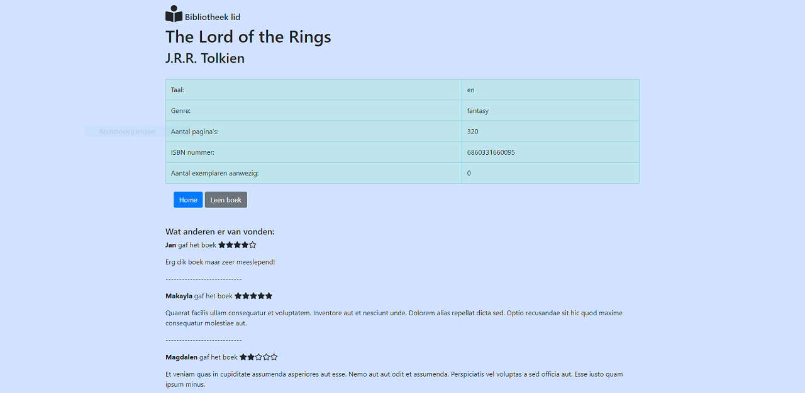

<h2>BIEB<h2>

This is a library web app for two types of users:

Library administrator

Library subscriber

Among other things, basically:

The administrator can add books and subscribers and should be able to do several kinds of data queries

The subscribers can view books, make reservations and do queries

 

<h4>Models:<h4>
 
<b>Book</b>
<table>
<tr><td>bookid</td><td>id van het boek</td></tr>
<tr><td>titel</td><td>titel van het boek</td></tr>
<tr><td>auteur</td><td>schrijver van het boek</td></tr>
<tr><td>taal</td><td>taal waarin het boek is geschreven</td></tr>
<tr><td>aantal_paginas</td><td>aantal paginas van het boek</td></tr>
<tr><td>isbn_no</td><td>isbn nr. van het boek</td></tr>
<tr><td>uitgeleend_aan</td><td>abonnee idno of NULL indien niet uitgeleend</td></tr>
</table>
 
<b>Member</b>
<table>
<tr><td>memberid</td><td>id van de abonnee</td></tr>
<tr><td>voornaam</td><td>voornaam gebruiker</td></tr>
<tr><td>achternaam</td><td>achternaam gebruiker</td></tr>
<tr><td>woonplaats</td><td>woonplaats gebruiker</td></tr>
<tr><td>abo_geldig_tot</td><td>wanneer het lidmaatschap afloopt</td></tr>
</table>
<b>LentBooks</b>
<table>
<tr><td>lent_book_id</td><td>id van het geleende boek in het LentBooks model</td></tr>
<tr><td>bookid</td><td>id van het boek in het Book model</td></tr>
<tr><td>userid</td><td>id van de user die het boek geleend heeft</td></tr>
</table>